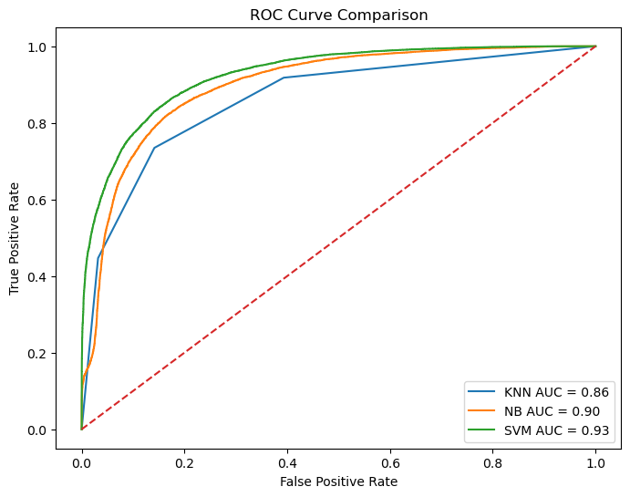

# Sleep Disorder Prediction using Machine Learning

## Project Overview

This project focuses on predicting sleep disorder risk using machine learning classification algorithms.

The dataset contains sleep, lifestyle, psychological, and health-related features of individuals.

## Algorithms Used

- K-Nearest Neighbors (KNN)
- Naive Bayes
- Support Vector Machine (SVM)

## Evaluation Metrics

The models were evaluated using:

- Accuracy
- Precision
- Recall
- F1-score
- True Positive Rate (TPR)
- False Positive Rate (FPR)
- Confusion Matrix
- ROC Curve
- AUC Score

## Results

| Model | Accuracy | AUC |
|---|---|---|
| KNN | 80.18% | 0.86 |
| Naive Bayes | 82.61% | 0.90 |
| SVM | 84.51% | 0.93 |

## Best Model

SVM achieved the best performance with:
- Accuracy: 84.51%
- AUC Score: 0.93

## Technologies Used

- Python
- Pandas
- NumPy
- Scikit-learn
- Matplotlib
- Jupyter Notebook

## ROC Curve Comparison

